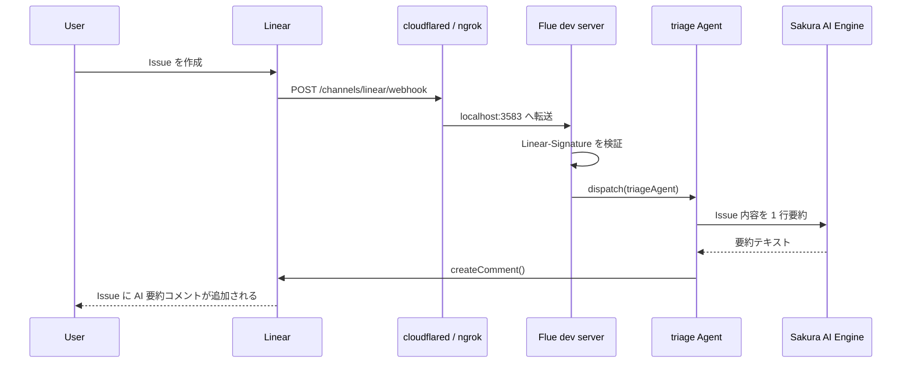

# gs-20260619-kadai-flue-linear

Flue で作った、Linear Issue 作成 webhook の 1/100 デモです。

Linear で Issue が作られたら、Flue Channel が webhook を受信し、さくらの AI Engine
`gpt-oss-120b` で Issue 内容を 1 行要約し、その Issue にコメントとして返します。

## 何を作ったか

最終ゴールは、Linear Issue 作成を起点に通知、サブ Issue、Google カレンダー、タスクアサイン、
AI 自動作業、PR、動作確認環境、人間チェックまでつなぐことです。

このリポジトリでは、そのうち最小の 1/100 として次の骨格だけを実装しています。

```txt
Linear Issue 作成
  -> Flue Channel が webhook 受信
  -> Flue Agent がさくら AI を呼び出す
  -> Linear API で同じ Issue にコメント返信
```

この 3 つが通れば、残りの 99% も「webhook 受信」「AI 処理」「外部 API 呼び出し」の組み合わせとして拡張できます。

## 実装済みの機能

- Linear の Issue 作成イベントだけを処理
- `@flue/linear` による webhook 署名検証
- Flue の `dispatch()` による triage agent の非同期起動
- さくら AI Engine `sakura/gpt-oss-120b` の provider 登録
- Issue の `title` / `description` / `identifier` を読んだ 1 行要約
- `post_linear_comment` tool による Linear コメント投稿
- 既存の対話 agent `assistant`
- 既存の要約 workflow `summarize`
- `/health` エンドポイント
- TypeScript typecheck / build / scaffold test
- `.env` を公開しないための `.gitignore` と `.env.example`

## やらないこと

この課題では意図的に次は実装していません。

- Slack やメールなどへの通知
- サブ Issue 作成
- Google カレンダー登録
- 担当者の自動アサイン
- AI による実作業
- GitHub PR 作成
- Preview 環境作成
- 人間レビュー UI

## アーキテクチャ



## ファイル構成

```txt
.
├── src/
│   ├── app.ts                  # Hono app、Sakura provider、flue() mount
│   ├── agents/
│   │   ├── assistant.ts         # 手動対話用の Flue agent
│   │   └── triage.ts            # Linear Issue を要約してコメントする agent
│   ├── channels/
│   │   └── linear.ts            # Linear webhook channel とコメント投稿 tool
│   └── workflows/
│       └── summarize.ts         # テキスト要約 workflow
├── test/
│   └── scaffold.test.mjs        # 主要ファイルと構成の検査
├── codex-flue-linear-channel.md # 実装指示書
├── flue.config.ts
├── package.json
├── tsconfig.json
└── .env.example
```

## 必要なもの

- Node.js 22.19.0 以上
- npm
- Linear API key
- Linear webhook signing secret
- さくらの AI Engine API token
- ローカル webhook 受信用の公開トンネル
  - `cloudflared` または `ngrok`

## セットアップ

```bash
npm install
cp .env.example .env
```

`.env` に実値を入れます。

```bash
SAKURA_API_TOKEN="replace-with-your-sakura-api-token"
LINEAR_API_KEY="replace-with-your-linear-api-key"
LINEAR_WEBHOOK_SECRET="replace-with-linear-webhook-signing-secret"
```

`.env` は `.gitignore` 済みです。公開リポジトリには含めません。

## 起動

```bash
npm run dev
```

Flue dev server は通常 `http://localhost:3583` で起動します。

確認:

```bash
curl http://localhost:3583/health
```

期待値:

```json
{"status":"ok"}
```

## Linear webhook のつなぎ方

ローカル環境で Linear から webhook を受けるには、公開 URL から `localhost:3583` へ転送する必要があります。

Cloudflare Tunnel の例:

```bash
cloudflared tunnel --url http://localhost:3583
```

ngrok の例:

```bash
ngrok http 3583
```

表示された公開 URL の末尾に `/channels/linear/webhook` を付けて、Linear の webhook URL に設定します。

```txt
https://<public-tunnel-host>/channels/linear/webhook
```

Linear 側では `Issues` イベントを有効にします。

webhook 作成時に表示される Signing Secret を `.env` の `LINEAR_WEBHOOK_SECRET` に設定し、`npm run dev` を再起動します。

## 動作確認

Linear で任意の Issue を作成します。

数秒後、その Issue に次のようなコメントが自動で追加されれば成功です。

```txt
🤖 AI要約: Linear Issue作成をトリガーに、Flue ChannelがWebhookを受信し、さくらAIで1行要約を生成して同Issueに自動コメントを投稿するパイプラインの初回疎通確認
```

## 開発用コマンド

```bash
npm test
npm run typecheck
npm run build
npm audit --audit-level=high
```

`npm run build` で次のように `channels linear` が表示されれば、Flue が channel を認識しています。

```txt
agents
  assistant
  triage

workflows
  summarize

channels
  linear
```

## 実装メモ

### `src/app.ts`

- `registerProvider('sakura', ...)` でさくら AI Engine を OpenAI Completions 互換 provider として登録
- Hono の `/health` を定義
- `app.route('/', flue())` で Flue の agents / workflows / channels を mount

### `src/channels/linear.ts`

- `createLinearChannel()` で `POST /channels/linear/webhook` を作成
- `LINEAR_WEBHOOK_SECRET` による署名検証は `@flue/linear` 側に任せる
- `payload.type === 'Issue'` かつ `payload.action === 'create'` のときだけ処理
- `dispatch(triageAgent, ...)` で agent に渡す
- `post_linear_comment` tool で Linear の `createComment()` を呼ぶ

### `src/agents/triage.ts`

- dispatch id の `issue-<issueId>` から Linear Issue ID を復元
- `post_linear_comment` tool を agent に渡す
- 「Issue を 1 行で要約し、必ずコメント投稿 tool を 1 回呼ぶ」よう instruction を設定
- コメント本文は `🤖 AI要約:` で始める

### `src/workflows/summarize.ts`

- 手動実行用の要約 workflow
- `payload.text` を 3 行以内で要約する

## セキュリティ

このリポジトリでは、実トークンを含めないために次を確認しています。

- `.env` は `.gitignore` に含める
- `.env.example` にはプレースホルダーだけを書く
- `node_modules/`, `dist/`, `.flue-vite/`, `.DS_Store` はコミットしない
- コミット前に staged content と HEAD を秘密値パターンでスキャン
- `npm audit --audit-level=high` で high 以上の脆弱性がないことを確認

## できたこと

- Flue プロジェクトの Node target 初期構成
- Sakura provider の登録
- 対話 agent の作成
- 要約 workflow の作成
- Linear Channel の追加
- Linear webhook 署名検証の導入
- Linear Issue 作成イベントの受信
- Flue agent への dispatch
- Sakura AI による Issue 要約
- Linear API によるコメント返信
- ローカル開発環境と Cloudflare Tunnel 経由の実 webhook 疎通
- GitHub 公開前の秘密値除外確認

## ここから拡張するなら

- Issue の priority / label / project に応じた triage 分岐
- 要約だけでなく「次にやること」の提案コメント
- サブ Issue 自動作成
- Slack / Discord / Gmail 通知
- Google Calendar 連携
- 担当者アサイン
- GitHub Issue / PR 連携
- Flue Cloudflare target へのデプロイ
- webhook delivery id による重複処理ガード

## 注意点

- Linear の webhook は短時間で 200 を返す必要があります。この実装では `dispatch()` で agent に渡す構成にしています。
- `cloudflared tunnel --url` や無料 ngrok の URL は一時的です。URL が変わったら Linear 側の webhook URL も更新してください。
- `LINEAR_WEBHOOK_SECRET` は webhook 作成時に表示される値を使います。
- 実トークンは README、Issue、コミットログに貼らないでください。
